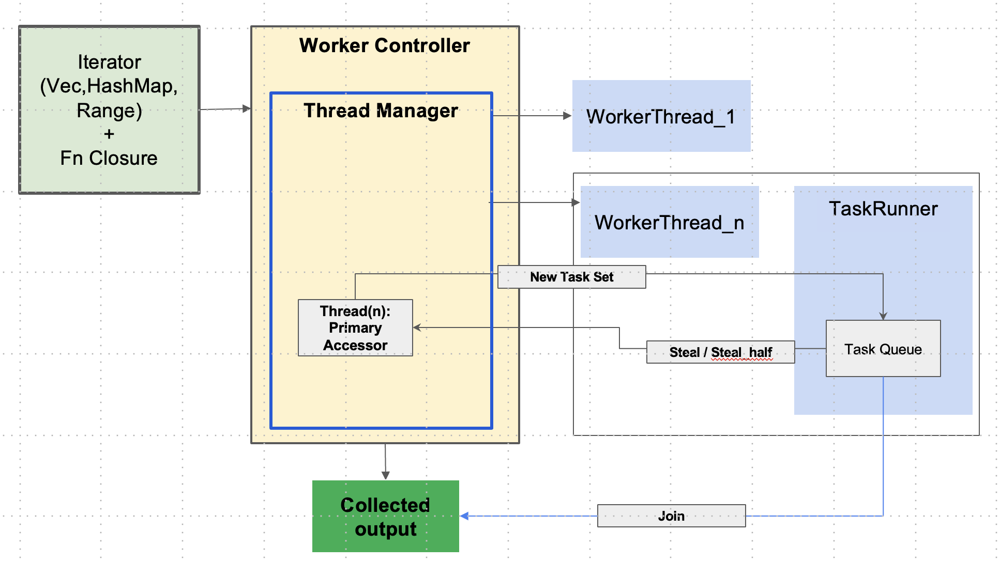

# Parallel Task Crate
A fast data parallelism library using Atomics to share data across threads and uniquely pull values from Collections such as Vec, HashMap, Range. It leverages a 'push' approach and employs an inhouse workstealing algorithm with atomics to manage . 
All tasks are treated equally. Each worker has its own local queue, and a central controller continuously polls these queues to measure load. When a worker becomes idle, it pulls roughly half the tasks from the heaviest queue. This ensures efficient CPU utilization, preserves task isolation, and dynamically balances work without relying on a global task queue.
Crate available: https://crates.io/crates/parallel_task

## What is the objective of this crate?
parallel_tasker is a high-performance parallel iteration library for Rust that is designed as a competent alternative to Rayon. I am a great admirer of Rayon crate and have used it extensively. Instead of making a 'me too', I wanted to experiment with a different algorithm:


This library does not use task-level priority or a global thread pool; all tasks are considered equal. It starts with 1 worker queue and spawns more based on the perception of whether its more efficient to spawn vs continue on current. Each worker thread owns its own local queue. A central controller continuously and non-intrusively polls all worker queues to determine their current load. From this, it computes a “queue priority vector” reflecting which queues have the most tasks available for stealing. When a worker becomes idle, it consults this vector and pulls roughly half of the tasks from the highest-load queue. This approach enables adaptive, guided work stealing that balances load across threads while keeping task execution isolated per queue. Unlike systems with a global task queue, this method preserves locality, prevents tasks from different functions from interfering, and ensures efficient utilization of CPU cores.

Redistribution of tasks is based on which thread is making least progress or has the largest queue and its jobs are picked and given to a free thread. It spawns new threads based on the load to expedite the calculations. The choices are made based on a cost analysis for instance, time to spawn a new thread vs. progress till date.


The key components are:
WorkerController - the master controller that absorbs the iter and the function closure. It operates within a scope and spawns threads as per the load.

ThreadManager - manages all the work threads and checks for free threads and spawns new ones if existing are all busy.

WorkerThread - the thread manager that contains a thread running a task loop. It signals when job is done and the worker controller pushes a new set of jobs

ThreadRunner - The actual task runner within the thread

PrioritizeThread - trait to decide the threads by priority 

The thread level queue is implemented via an inhouse concept of LimitedAccessQueue. This can be accessed only via two ReadAccessors provided at the time of creation - primary and secondary. Only Primary has the ability to steal tasks from the Queue while both may add tasks. WorkerController controls the primary and employs this to redistribute tasks post the main queue being complete. Synchronisation is supported using atomics. This is a very fast queue with limited to no latency. 

This design provides low overhead, minimal contention, and predictable cache-friendly access patterns. Benchmarks show that it performs within ~5% of Rayon for mid to large workloads, such as Monte Carlo simulations with 100,000 iterations, while maintaining a simple scheduling logic.

### Guardrails in place
There are several guard rails such as:
1. The scheduler algorithm never spawns beyond the available CPU cores * 2 (Thread per CPU core).
2. The controller constantly polls to ensure that some queue is not bloated and keeps pulling tasks away in such a case
3. Unsafe code is handly safely. For instance the LimitedAccessQueue is captured as a pointer to a memory on the heap. QueuePtr struct envelops this pointer and has a suitable drop function to prevent 'double free' or 'dangling pointer' concerns. This allows safe sharing across two accessors concurrently
4. Accessors are purposefully limited to a Primary and a Secondary to prevent any data races. They cannot be cloned. This serves it purpose of provide external and internal access to a resource (the queue) in a faithful manner.

## Benchmarking analysis
This has been tested via a cargo bench analysis, a sample of which has been shown below.
The benchmarking exercise.
### About the analysis
The create_micro_jobs function creates a distribution where 90% of jobs run 50-500 microseconds and 10% run 500-1000 microseconds. This is a realistic load-balancing stress test—it's designed to create scenarios where some threads finish quickly and others are still working, forcing the scheduler to actually steal work.
The benchmark was conducted over Normal (no concurrency ie. sequential), Rayon and Parallel_Task as PT.
### The results
Results are as follows:
```
Benchmarking Normal (owned): Warming up for 3.0000 s
Warning: Unable to complete 100 samples in 5.0s. You may wish to increase target time to 32.8s, or reduce sample count to 10.
Normal (owned)          time:   [321.10 ms 321.38 ms 321.75 ms]
                        change: [-1.1089% -0.6577% -0.2496%] (p = 0.00 < 0.05)
                        Change within noise threshold.
Found 13 outliers among 100 measurements (13.00%)
  2 (2.00%) high mild
  11 (11.00%) high severe

Rayon (owned)           time:   [47.934 ms 49.129 ms 50.438 ms]
                        change: [+9.7909% +12.627% +15.778%] (p = 0.00 < 0.05)
                        Performance has regressed.
Found 5 outliers among 100 measurements (5.00%)
  4 (4.00%) high mild
  1 (1.00%) high severe

PT (owned)              time:   [47.055 ms 47.701 ms 48.436 ms]
                        change: [+0.5821% +2.6327% +4.7664%] (p = 0.01 < 0.05)
                        Change within noise threshold.
Found 5 outliers among 100 measurements (5.00%)
  4 (4.00%) high mild
  1 (1.00%) high severe

Benchmarking Normal (&iter): Warming up for 3.0000 s
Warning: Unable to complete 100 samples in 5.0s. You may wish to increase target time to 32.2s, or reduce sample count to 10.
Normal (&iter)          time:   [321.21 ms 321.65 ms 322.21 ms]
                        change: [-3.9620% -1.6621% -0.2477%] (p = 0.08 > 0.05)
                        No change in performance detected.
Found 16 outliers among 100 measurements (16.00%)
  1 (1.00%) high mild
  15 (15.00%) high severe

Rayon (&iter)           time:   [43.297 ms 43.536 ms 43.788 ms]
                        change: [-7.7753% -4.9874% -2.6056%] (p = 0.00 < 0.05)
                        Performance has improved.
Found 4 outliers among 100 measurements (4.00%)
  4 (4.00%) high mild

PT (&iter)              time:   [45.483 ms 46.503 ms 47.860 ms]
                        change: [-2.9406% -0.2446% +2.7412%] (p = 0.88 > 0.05)
                        No change in performance detected.
Found 7 outliers among 100 measurements (7.00%)
  4 (4.00%) high mild
  3 (3.00%) high severe
```


The benchmarking results are very good and show comparable performance to the popular Rayon library. That said, as this is a recent library, users are encouraged to test this well within their use cases or POCs to ensure suitability and applicability. 

Please try at your end and share your feedback at jayanth.ravindran@gmail.com.
Note: if you wish to contribute you are more than welcome.

## Usage example

Add this using:
```
cargo add parallel_task
```

```
use parallel_task::prelude::*;
let job = || {              
        std::thread::sleep(Duration::from_nanos(10)); 
        (0..1_000).sum::<i32>()
    };
let vec_jobs = (0..100_000).map(|_|job).collect::<Vec<_>>(); 

// Parallel Iter example
let r1 = vec_jobs.parallel_iter().map(|func| func()).collect::<Vec<i32>>();

// Into Parallel Iter that consumes the vec_jobs
let r1 = vec_jobs.into_parallel_iter().map(|func| func()).collect::<Vec<i32>>();

// Print all values using a for_each. This runs for_each concurrently on a Vec or HashMap
r1.parallel_iter().for_each(|val| { print!("{} ",*val);});
```
