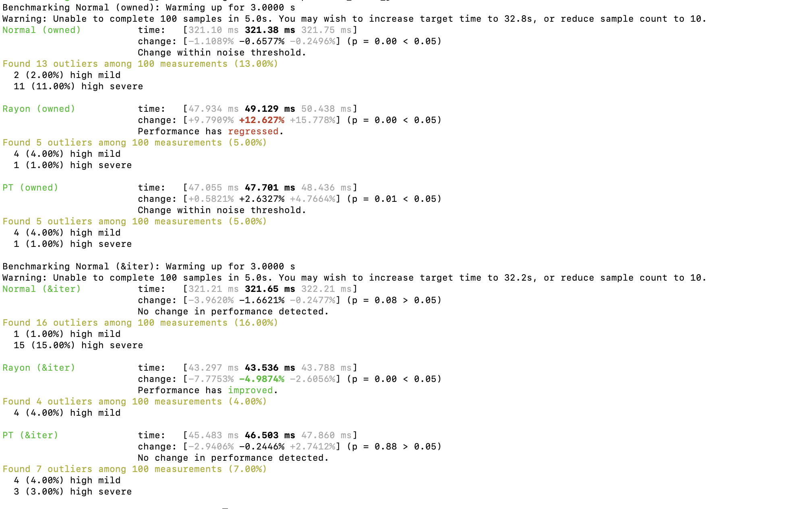

# Parallel Task Crate
A fast data parallelism library using Atomics to share data across threads and uniquely pull values from Collections such as Vec, HashMap, Range. It leverages a 'push' approach and employs an inhouse workstealing algorithm with atomics to manage . 
There is no global queue. Each spawned worker gets its own local queue, and all tasks are treated equally. A central controller monitors queue loads and guides idle workers to steal tasks from the most loaded queues. This ensures efficient CPU utilization, preserves task isolation, and balances work dynamically without a global task queue.

## What is the objective of this crate?
parallel_tasker is a high-performance parallel iteration library for Rust that is optional to Rayon. I am a great admirer of Rayon crate and have used it extensively. Instead of making a 'me too', I wanted to experiment with a different algorithm:


This library does not use task-level priority or a global thread pool; all tasks are considered equal. It starts with 1 worker queue and spawns more based on the perception of whether its more efficient to spawn vs continue on current. Each worker thread owns its own local queue. A central controller continuously and non-intrusively polls all worker queues to determine their current load. From this, it computes a “queue priority vector” reflecting which queues have the most tasks available for stealing. When a worker becomes idle, it consults this vector and pulls roughly half of the tasks from the highest-load queue. This approach enables adaptive, guided work stealing that balances load across threads while keeping task execution isolated per queue. Unlike systems with a global task queue, this method preserves locality, prevents tasks from different functions from interfering, and ensures efficient utilization of CPU cores.

Redistribution of tasks is based on which thread is making least progress or has the largest queue and its jobs are picked and given to a free thread. It spawns new threads based on the load to expedite the calculations. The choices are made based on a cost analysis for instance, time to spawn a new thread vs. progress till date.


The key components are:
WorkerController - the master controller that absorbs the iter and the function closure. It operates within a scope and spawns threads as per the load.

ThreadManager - manages all the work threads and checks for free threads and spawns new ones if existing are all busy.

WorkerThread - the thread manager that contains a thread running a task loop. It signals when job is done and the worker controller pushes a new set of jobs

ThreadRunner - The actual task runner within the thread

The thread level queue is implemented via an inhouse concept of LimitedAccessQueue. This can be accessed only via two ReadAccessors provided at the time of creation - primary and secondary. Only Primary has the ability to steal tasks from the Queue while both may add tasks. WorkerController controls the primary and employs this to redistribute tasks post the main queue being complete. Synchronisation is supported using atomics. This is a very fast queue with limited to no latency. 

This design provides low overhead, minimal contention, and predictable cache-friendly access patterns. Benchmarks show that it performs within ~5% of Rayon for mid to large workloads, such as Monte Carlo simulations with 100,000 iterations, while maintaining a simple scheduling logic.
This has been tested via a cargo bench analysis, a sample of which has been shown below.
Here, PT refers to Parallel_task flow. A benchmark was designed to run over a range of tasks with times that ranged from micro to early millis. The three scenarios considered were running it on: a: Normal (without concurrency), b: Rayon and c: Parallel_Task crate.



The benchmarking results are very good and show comparable performance to the popular Rayon library. That said, as this is a recent library, users are encouraged to test this well within their use cases or POCs to ensure suitability and applicability. 

Please try at your end and share your feedback at jayanth.ravindran@gmail.com.
Note: if you wish to contribute you are more than welcome.

## Usage example

Add this using:
```
cargo add parallel_task
```

```
use parallel_task::prelude::*;
let job = || {              
        std::thread::sleep(Duration::from_nanos(10)); 
        (0..1_000).sum::<i32>()
    };
let vec_jobs = (0..100_000).map(|_|job).collect::<Vec<_>>(); 

// Parallel Iter example
let r1 = vec_jobs.parallel_iter().map(|func| func()).collect::<Vec<i32>>();

// Into Parallel Iter that consumes the vec_jobs
let r1 = vec_jobs.into_parallel_iter().map(|func| func()).collect::<Vec<i32>>();

// Print all values using a for_each. This runs for_each concurrently on a Vec or HashMap
r1.parallel_iter().for_each(|val| { print!("{} ",*val);});
```
